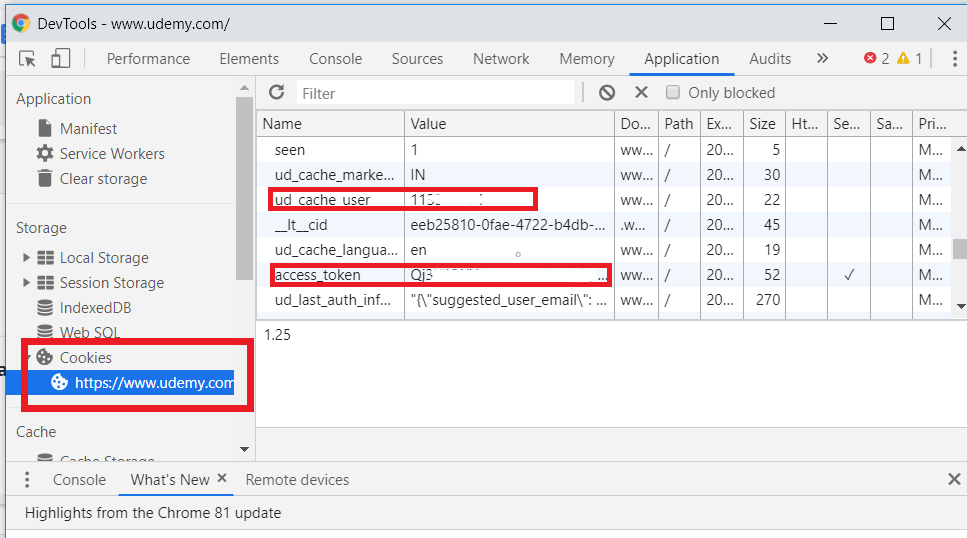

# Udemy-Free-Courses-Adder
One Click to Add All Udemy Free Courses To Your Account

With this script you can add all free courses available on udemy to your account or any specific if you want to

## ***Requirements***

- Python (2 or 3)
- Python `pip`
- Python module `requests`
- Python module `colorama`

## ***Module Installation***

	pip install -r requirements.txt

## ***Usage***

***Add all/specific course***

    python udemy.py -c cookie_file_name.txt

## ***Create Cookie File***

- First go to udemy.com in chrome browser
- Login with your account
- Now right click and go to inspect then go to Application and follow below stpes

</img>  
 
 
</img>

- Now create a file named cookie.txt and add access_token, name and ud_cache_user in format **access_token||your name||ud_cache_user**
- Now run script using above command in **Usage**
